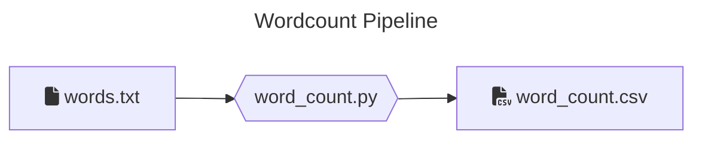
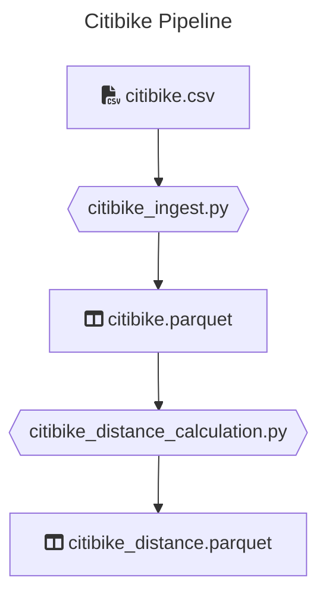

# Data transformations with Python

This coding challenge is a collection of _Python_ jobs that are supposed to extract, transform and load data.
These jobs are using _PySpark_ to process larger volumes of data and are supposed to run on a _Spark_ cluster (via `spark-submit`).

## Gearing Up for the Pairing Session

**✅ Goals**

1. **Get a working environment**  
   Either local ([local](#local-setup), or using [gitpod](#gitpod-setup))
2. **Running the jobs, getting the data and having fun with world economic trade data**
3. Further develop the capabilities of this spark application and deriving insights about the workings of the global economy


### Local Setup

> 💡 If you don't manage to run the local setup or you have restrictions to install software in your laptop, use the [gitpod](#gitpod-setup) one

#### Pre-requisites

Please make sure you have the following installed and can run them

- Python (3.11.X), you can use for example [pyenv](https://github.com/pyenv/pyenv#installation) to manage your python versions locally
- [Poetry](https://python-poetry.org/docs/#installation)
- Java (11), you can use [sdkman](https://sdkman.io/) to install and manage java locally

#### Windows users

It's highly recommended to use WSL 2 on Windows, due to the [lack of support](https://cwiki.apache.org/confluence/display/HADOOP2/WindowsProblems) of windows paths from Hadoop/Spark.

Follow instructions on the [Windows official page](https://learn.microsoft.com/en-us/windows/wsl/setup/environment)

> 💡 In case of issues, an easier way to use gitpod [gitpod setup](#gitpod-setup)

#### Install all dependencies

```bash
poetry install
```

### Gitpod setup

Alternatively, you can setup the environment using

[](https://gitpod.io/#https://github.com/yaniskon/Macrotrade-pyspark)

There's an initialize script setup that takes around 3 minutes to complete. Once you use paste this repository link in new Workspace, please wait until the packages are installed. After everything is setup, select Poetry's environment by clicking on thumbs up icon and navigate to Testing tab and hit refresh icon to discover tests.

Note that you can use gitpod's web interface or setup [ssh to Gitpod](https://www.gitpod.io/docs/references/ides-and-editors/vscode#connecting-to-vs-code-desktop) so that you can use VS Code from local to remote to Gitpod

Remember to stop the vm and restart it just before the interview.

### Verify setup

> All of the following commands should be running successfully

#### Run unit tests

```bash
poetry run pytest tests/unit
```

#### Run integration tests

```bash
poetry run pytest tests/integration
```

#### Run style checks

```bash
poetry run mypy --ignore-missing-imports --disallow-untyped-calls --disallow-untyped-defs --disallow-incomplete-defs \
            data_transformations tests

poetry run pylint data_transformations tests
```


## Jobs

There are 2 jobs in this repo: Reference table list and the WorldShare data.

Currently, these exist as skeletons, and have some **initial test cases** which are defined but some are skipped.

The following section provides context over them.


### Code walk

```

/
├─ /data_transformations # Contains the main python library
│ # with the code to the transformations
│
├─ /jobs # Contains the entry points to the jobs
│ # performs argument parsing, and are
│ # passed to `spark-submit`
│
├─ /resources # Contains the raw datasets for the jobs
│
├─ /tests
│ ├─ /units # contains basic unit tests for the code
│ └─ /integration # contains integrations tests for the jobs
│ # and the setup
│
├─ .gitignore
├─ .gitpod\* # required for the gitpod setup
├─ .pylintrc # configuration for pylint
├─ LICENCE
├─ poetry.lock
├─ pyproject.toml
└─ README.md # The current file

```

### Refence List tables

# Metadata Tables Ingestion

The first step in our data processing pipeline is to extract and store all metadata tables. This process involves:

1. Extracting metadata tables from the untradeapicall source
2. Converting them into parquet format for efficient storage and access
3. Saving them for later use in the pipeline

This is accomplished by running the `referenceTables_ingest` job, which handles the extraction and transformation of these metadata tables into parquet files. These parquet files will serve as a reference for subsequent data processing steps, ensuring we have quick and efficient access to the metadata when needed.


This initial step sets up the foundation for all subsequent data processing operations in our pipeline.

```bash
poetry run spark-submit jobs/referenceTables_ingest.py \ 
    <OUTPUT_PATH> 
```
```bash example
poetry run spark-submit jobs/referenceTables_ingest.py \ 
    data/ref_tables
```



#### Input

Simple `*.txt` file containing text.

#### Output

A single `*.csv` file containing data similar to:

```csv
"word","count"
"a","3"
"an","5"
...
```

#### Run the job

```bash
poetry run spark-submit jobs \ getWorldShareAnnual.py \ 
    <INPUT_FILE_PATH>  \
    <OUTPUT_PATH> 
```
```bash
poetry run spark-submit jobs/getWorldShareAnnual.py  data/yo.parquet data/worldshare/Annual
```
```bash
poetry run spark-submit jobs/getWorldShare_query_plan.py data/ref_tables data/worldshare/util/reporter-year.parquet
```

### Citibike

**_This problem uses data made publicly available by [Citibike](https://citibikenyc.com/), a New York based bike share company._**

For analytics purposes, the BI department of a hypothetical bike share company would like to present dashboards, displaying the
distance each bike was driven. There is a `*.csv` file that contains historical data of previous bike rides. This input
file needs to be processed in multiple steps. There is a pipeline running these jobs.



There is a dump of the datalake for this under `resources/citibike/citibike.csv` with historical data.

#### Ingest

Reads a `*.csv` file and transforms it to parquet format. The column names will be sanitized (whitespaces replaced).

##### Input

Historical bike ride `*.csv` file:

```csv
"tripduration","starttime","stoptime","start station id","start station name","start station latitude",...
364,"2017-07-01 00:00:00","2017-07-01 00:06:05",539,"Metropolitan Ave & Bedford Ave",40.71534825,...
...
```

##### Output

`*.parquet` files containing the same content

```csv
"tripduration","starttime","stoptime","start_station_id","start_station_name","start_station_latitude",...
364,"2017-07-01 00:00:00","2017-07-01 00:06:05",539,"Metropolitan Ave & Bedford Ave",40.71534825,...
...
```

##### Run the job

```bash
poetry build && poetry run spark-submit \
    --master local \
    --py-files dist/data_transformations-*.whl \
    jobs/citibike_ingest.py \
    <INPUT_FILE_PATH> \
    <OUTPUT_PATH>
```

#### Distance calculation

This job takes bike trip information and adds the "as the crow flies" distance traveled for each trip.
It reads the previously ingested data parquet files.

Hint:

- For distance calculation, consider using [**Haversine formula**](https://www.movable-type.co.uk/scripts/latlong.html) as an option.

##### Input

Historical bike ride `*.parquet` files

```csv
"tripduration",...
364,...
...
```

##### Outputs

`*.parquet` files containing historical data with distance column containing the calculated distance.

```csv
"tripduration",...,"distance"
364,...,1.34
...
```

##### Run the job

```bash
poetry build && poetry run spark-submit \
    --master local \
    --py-files dist/data_transformations-*.whl \
    jobs/citibike_distance_calculation.py \
    <INPUT_PATH> \
    <OUTPUT_PATH>
```

---

> ⚠️ do not try to solve the exercises ahead of the interview

---

## Reading List

If you are unfamiliar with some of the tools used here, we recommend some resources to get started

- **pytest**: [official](https://docs.pytest.org/en/8.2.x/getting-started.html#get-started)
- **pyspark**: [official](https://spark.apache.org/docs/latest/api/python/index.html) and especially the [DataFrame quickstart](https://spark.apache.org/docs/latest/api/python/getting_started/quickstart_df.html)
